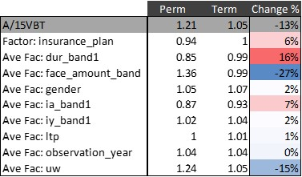

```{r setup, include=FALSE}
knitr::opts_chunk$set(echo = TRUE)
```

```{r libraries, include = FALSE}
library(tidyverse)
library(rpivotTable)
library(magrittr)
library(DT)

library(ggplot2)
library(ggeffects)
library(data.table)
library(dtplyr)
library(flextable)

library(arrow)
```

# Input: ILEC 2009-2013
```{r input}
#ilecData <- read.csv(file = '../../BDH/data_exhibit_g_summary.csv')
ilecData <- read_parquet(
  file='../../BDH/data_exhibit_g_summary.parquet'
)
head(ilecData)
```

```{r relevel, echo = FALSE}
# so to produce the same model as in python
ilecData %<>%
    mutate(uw = fct_relevel(factor(uw), ref ="N/2/1"),
           dur_band1 = fct_relevel(factor(dur_band1), ref ="06-10"),
           face_amount_band= fct_relevel(factor(face_amount_band), ref ="  100000-249999"),
           ia_band1= fct_relevel(factor(ia_band1), ref ="40-44"),
           insurance_plan= fct_relevel(factor(insurance_plan), ref ="Term"),
           ltp= fct_relevel(factor(ltp), ref ="20 yr or N/A (Not Term)"),
           observation_year = fct_relevel(factor(observation_year),ref ="2009"),
           gender=factor(gender),
           iy_band1=factor(iy_band1)
           )
```

# Build Simple GLM Models: Amount and Count

## Amount Basis Model
```{r modelAmt, echo = FALSE}
modelAmt <- glm(amount_actual ~ uw 
                + dur_band1
                + face_amount_band
                + ia_band1
                + gender
                + observation_year
                + insurance_plan
                + ltp
                + iy_band1
                + offset(log(amount_2015vbt)), 
                family=quasipoisson, 
                data=ilecData)
# Show summary of the model
modelAmt %>% as_flextable()

# Append predictions to the dataset
ilecData$amount_amountmodel  = predict(modelAmt,ilecData,type="response")

```
## Count Basis Model
```{r modelCnt}
# Count basis model
modelCnt <- glm(policy_actual ~ 
                  uw 
                + dur_band1
                + face_amount_band
                + ia_band1
                + gender
                + observation_year
                + insurance_plan
                + ltp
                + iy_band1
                + offset(log(policy_2015vbt)), family=poisson, data=ilecData)
# Show summary of the model
modelCnt %>% as_flextable()

# Append predictions to the dataset
ilecData$policy_policymodel  = predict(modelCnt,ilecData,type="response")
# write.csv(ilecData, 'ilecData_0913.csv')

```

```{r effects-plots-amount}
# Plot amount model terms
lapply(
  names(ilecData)[1:9],
  function(s) {
    p <- ggeffect(modelAmt,
                  s,
                  offset=0) %>%
      mutate(
        x=fct_relevel(
          x,
          sort(levels(x))
        )
      ) %>%
      as.data.table() %>%
      ggplot(
        aes(
          x=x,
          y=predicted)
      ) +
      geom_point() +
      geom_errorbar(
        aes(
          ymin=conf.low,
          ymax=conf.high
        )
      ) +
      scale_y_continuous(
        name="Factor",
        labels=scales::percent
      ) +
      scale_x_discrete(
        name=s
      ) +
      theme_minimal() +
      theme(
        axis.text.x = element_text(angle=45)
      )

    return(p)
  }
)

```

```{r effects-plots-count}
# Plot amount model terms
lapply(
  names(ilecData)[1:9],
  function(s) {
    p <- ggeffect(modelCnt,
                  s,
                  offset=0) %>%
      as.data.table() %>%
      ggplot(
        aes(
          x=x,
          y=predicted)
      ) +
      geom_point() +
      geom_errorbar(
        aes(
          ymin=conf.low,
          ymax=conf.high
        )
      ) +
      scale_y_continuous(
        name="Factor",
        labels=scales::percent
      ) +
      scale_x_discrete(
        name=s
      ) +
      theme_minimal() +
      theme(
        axis.text.x = element_text(angle=45)
      )

    return(p)
  }
)

```

# Results in Pivot Table
```{r pivot}
ilecData %>%
  rpivotTable(
    cols = c("gender"),
    rows = c("insurance_plan"),
    aggregatorName = "Sum over Sum", vals = c("amount_actual", "amount_2015vbt"),
    subtotals = TRUE
  )

```

# User Defined Functions

```{r UDFs} 
## This one just puts A/E ratios in a good format. 
### df: dataframe, e.g., ilecData
### rf: risk factor of interest, e.g., products
### model: GLM model, e.g., modelCnt
aeSummary <- function(df, rf) {
  df %>% 
    group_by(across(c(rf))) %>% 
    summarize(
      `A/E` = sum(policy_actual, na.rm = TRUE) / sum(policy_2015vbt, na.rm = TRUE)
    ) %>% pivot_wider(
      names_from = {{rf}}, 
      values_from = `A/E`
    ) %>% mutate(
      rowname = "A/15VBT"
    ) %>% select(
      rowname, names(.)
    )
}

## get the coefficients from GLM models

allCoef <- function(df, model) {
  df %>% 
    Filter(is.factor, .) %>% 
    map(levels) %>% 
    enframe() %>% 
    unnest(
      cols = c(value)
    ) %>% 
    mutate(
      predictor = name,
      observation = value,
      value = paste0(name, value)
    ) %>% 
    merge(
      coefficients(model) %>% 
        enframe( 
          name = "predictor", 
          value = "coefficient"
        ) 
      , by.x = c('value'), by.y = c('predictor'), all.x = TRUE, na.action()
    ) %>% 
    mutate(
      coefficient = if_else(is.na(coefficient), 1, exp(coefficient),2)
    ) 
}

### dfCoef: coefficients returned from allCoef function
get_coef_row <- function(dfCoef, rf) {
  dfCoef %>% 
    filter(predictor == rf) %>% 
    select(observation, coefficient) %>%
    pivot_wider(
      names_from = observation, 
      values_from = coefficient
    ) %>% mutate(
      rowname = paste0("Factor: ", rf)
    ) %>% select(rowname, names(.))
}  

## Create a table of aggregate expected (e.g., 15vbt) in two dimensions
### dimension: largely means other predictors than "rf", the predictor of interest.
mExpected <- function(df, dfCoef, rf, dimension) {
  df %>%
    group_by(across(c(rf, dimension))) %>%
    summarize(
      measure = sum(policy_2015vbt, na.rm = TRUE), 
    )  %>% 
    pivot_wider(
      names_from = {{rf}}, 
      values_from = measure,
      values_fill = 0
    ) %>% mutate(
      predictor = dimension,
      observation = !!sym(dimension)
    ) %>% select(-c({{dimension}})) %>% 
    merge(
      dfCoef, 
      by = c("predictor", "observation")
    )
}

## Calculate average factors
avgCoef <- function(df, dfCoef, rf) {
  tibble(
    others = Filter(is.factor, df) %>% 
      names() %>%
      Filter(function(f) !identical(f, {{rf}}), .)
  ) %>% 
  mutate (
    expMatrix = map(
      others, 
      function(predictor) {
        mExpected(ilecData, dfCoef, rf, predictor)}
      )  
  ) %>% unnest(cols = expMatrix)  %>% 
    select(-c("name", "others", "value")) %>%
      pivot_longer(
        cols = -c(predictor, observation, coefficient), 
        names_to = "dimension", 
        values_to = "value"#, 
      ) %>%
      group_by(
        dimension, predictor
      ) %>% 
      summarize(
        avg = sum(coefficient * value, na.rm = TRUE)/sum(value, na.rm = TRUE)
      ) %>% pivot_wider (
        names_from = dimension, 
        values_from = avg
      ) %>%
      rename(
        rowname = predictor
      )%>%
    mutate(rowname = paste0("Ave Fac: ", rowname))
}

# this is the main funtion to produce tables for further analysis
mainF <- function(df, model, rf) {
  coefs <- allCoef(df, model)
  rbind(
    aeSummary(df, rf),
    get_coef_row(coefs, rf),
    avgCoef(df, coefs, rf) 
  ) 
}
```

# Output

This section largely reproduces BH's publicaiton. For better understanding of the tables generated below, please refer to the publication.

```{r output, message = FALSE, warning = FALSE,results='asis'}
# Use "map" function to call in all predictors
map(Filter(is.factor, ilecData) %>% names(),
    function(rf) {mainF(df = ilecData, model = modelCnt, rf = rf) %>% DT::datatable()  %>% formatRound(columns = (.$x$data %>% colnames())[3:length(.$x$data)])}
)  
```

# Use Case - Product Difference
One question of interest to actuaries is why different products have different mortality outcomes. Many things could contribute to the difference, such as UW practice, anti-selection risk level, market segment, etc., and generally, it is hard to quantify their impact. With GLM model and relevant analysis, we have a possible solution.

Let us revisit the table output with insurance plan as the predicator of interest.
```{r PermVsTerm, message = FALSE, warning = FALSE}
# function that calls individual predictor, e.g., insurance plans. 
mainF(ilecData, modelCnt, "insurance_plan") %>% DT::datatable()  %>% formatRound(columns = (.$x$data %>% colnames())[3:length(.$x$data)])

```

For illustration, let us select Perm and Term for pairwise comparison. By A/15VBT, Perm (121%) seems to have worse mortality than Term (105%). Is this due to "product differences"? As simple as this model may be, it provides us its (model) interpretation, which is opposite to what we have observed: based on the factors of insuarnce_plan, the model suggests Perm has better mortality, 94% for Perm vs 100% for Term. The remaining question is - if Perm indeed has better mortality, then why does it have the terrible A/15VBT of 121%? It only makes sense to say that the reasons might lie in the other predictors, but which ones are the main drivers?

```{r echo=FALSE}

```
Thanks to the GLM model, with Poisson error distribution and its canonical Log link function, we can work with a multiplicative formula for prediction. And, with this elegant structure, we can parse out the impact of each individual predictor and make comparisons. The relative impact is represented by rate of change.

One can see face_amount_band is the most influential, with largest change of -27% (slope). This means that, if all the other predictors are controlled, the face_amount_band factor will make Perm mortality prediction 27% higher than that of Term. Similarly, dur_band1 (16%) and uw (-15%) are also influential but relatively at a lesser degree. This may suggest, if actuaries/modelers want to build a simpler model yet still capture essential impact to mortality outcome, they may consider including only the 3 predicators in the GLM model. Furthermore, ia_band1 and insurance_plan, might be moderately useful and the other factors are relatively insignificant.

Alternative explanation: One can see that the weighted average of face amount band factors for Perm is much higher than for term. One can check both the 2015 VBT tabular claims by count and the actual-to-model ratios.

```{r by-product-distribution}
ilecData %>%
  filter(insurance_plan %in% c("Perm","Term")) %>%
  group_by(face_amount_band,
           insurance_plan) %>%
  summarize(
            AM_policy=sum(policy_actual)/sum(policy_policymodel),
            policy_2015vbt=sum(policy_2015vbt)) %>%
  mutate(
    face_amount_band=fct_relevel(face_amount_band,
                                 sort(levels(face_amount_band)))
  ) %>%
  ggplot(aes(x=face_amount_band)) +
  geom_bar(aes(y=policy_2015vbt),
           stat="identity") +
  facet_wrap(facets=vars(insurance_plan)) +
  scale_y_continuous(
    labels=scales::number,
    name="2015 VBT Tabular Claims by Count"
  ) +
  theme_minimal() +
  theme(axis.text.x = element_text(angle=45))
```
The distribution of claims for Perm shows a clear skew toward lower face amounts on a risk adjusted basis. 

```{r by-product-residuals}
ilecData %>%
  filter(insurance_plan %in% c("Perm","Term")) %>%
  group_by(face_amount_band,
           insurance_plan) %>%
  summarize(
            AM_policy=sum(policy_actual)/sum(policy_policymodel),
            policy_actual=sum(policy_actual)) %>%
  mutate(
    face_amount_band=fct_relevel(face_amount_band,
                                 sort(levels(face_amount_band)))
  ) %>%
  ggplot(aes(x=face_amount_band)) +
  geom_point(aes(y=AM_policy,group=1)) +
  geom_errorbar(aes(
    ymin=AM_policy-1.96/sqrt(policy_actual),
    ymax=AM_policy+1.96/sqrt(policy_actual)
  )) +
  geom_hline(yintercept=1,color="blue",linetype=2) +
  facet_wrap(facets=vars(insurance_plan)) +
  scale_y_continuous(
    labels=scales::percent,
    name="Actual-to-Model Ratio"
  ) +
  ggtitle("Residuals of Actuals versus Count-based Model") +
  theme_minimal() +
  theme(axis.text.x = element_text(angle=45))
```
How does this translate to mortality? It is possible to look at the residuals of the actual mortality versus the model predicted mortality for Term and Perm by face amount band. For both products, there is residual interaction effects not modeled in the pure main effects model. If an actuary needs additional accuracy, then it is possible to manually add the interaction. However, there are more robust methods of GLM model building.

This pairwise analysis can be easily extended to other predictors of interest and expanded to multi-variable case. The latter case will require more complex statistical analysis, which is not in the scope of this project.


